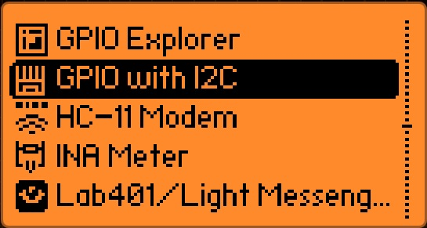

# Flipper NetNinja Feberis Firmware Update

## Project Description

This project provides a simple way to flash firmware onto ESP32-based NetNinja and Feberis boards using the **Flipper Zero**.

It is designed for makers, hackers, and developers who want to perform firmware updates without special tools or extra hardware – only using the Flipper Zero as a **USB-UART bridge** and the [ESP Web Flasher](https://esp.huhn.me).

Supported features:
- Flashing firmware to NetNinja / Feberis using Flipper Zero as a bridge
- Full update process via web browser (no drivers or command line required)
- Compatible with ESP32 Marauder firmware builds

---

## Example Firmware

In this example, we flash the **RogueMaster** build `RM0329-1941-0.420.0-d161b19` using the Flipper Zero and the ESP Web Flasher.

---

## Firmware Flashing Process

### ✅ Step-by-step guide

1. **Connect your NetNinja or Feberis board to the Flipper Zero** via GPIO/UART.
2. **Power on your Flipper Zero.**
3. **Enter DOWNLOAD mode** on the board:
    - Press and hold **left button**
    - While holding, press **right button once**
    - Release the **left button**
4. On the Flipper:
    - Navigate to **Apps**
  
      
    
    - Navigate to **GPIO**
      
    
    - Select **GPIO with I2C**
      
    
    - Choose **USB-UART Bridge**
      
    

6. **Connect the Flipper to your computer via USB.**

7. **Download the firmware** (example):  
   [ESP32_Marauder_FEBERIS_v1_4_1.bin](https://github.com/bpmcircuits/ESP32Marauder_FEBERIS/releases)  
   *(or any compatible .bin file)*

8. Open the browser and go to:  
   👉 [https://esp.huhn.me](https://esp.huhn.me)
    

10. Click **Connect** and select your Flipper Zero – it should appear as a serial port (e.g. `FlipperZero (COMx)` or similar).
    

12. In the interface, under the **0x10000** field, select the `ESP32_Marauder_FEBERIS_v1_4_1.bin` file.

    
    
14. Click **Flash** to begin the update.

    

---

### 🖼️ Web Interface Example

Below is an example of the web flasher setup screen:

---

## Technical Details

### NetNinja

- Communication: UART / USB-C  
- Firmware format: `.bin`  
- Power: 5V  
- [ESP32Marauder_NetNinja repo](https://github.com/bpmcircuits/ESP32Marauder_NetNinja)

### Feberis

- Communication: UART / USB-C    
- Firmware format: `.bin`
- Power: 3.3V / 5V  
- [ESP32Marauder_FEBERIS repo](https://github.com/bpmcircuits/ESP32Marauder_FEBERIS)

---

## License

This project is licensed under the **MIT License** – see the [LICENSE](LICENSE) file for details.

---

## Authors

Created by [Your Name or Nickname] – contributions are welcome!
